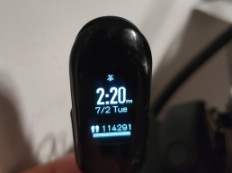

# how-i-won-my-company-walkathon

## The Backstory
I normally run 10+ miles per week, swim, and play sports (like soccer), and with all of that accounted for I would usually end my days with around 10,000 steps.  When I saw other users getting 80,000+ steps per day I began to question the integrity of the Walkathon.

Then I thought to myself... is this even possible?  Let's look at the data.

## The Data
https://blog.fitbit.com/extreme-user-story-how-many-steps-does-it-take-to-get-to-kona/

According to this fitbit blog it is possible to obtain 80,000 steps per day... if you are running an Ironman Race.

The Walkingspree app showed that **some people were walking the equivalent of an iron man race every single day**.  Bullshit.

## The Comeback
So naturally I had to step up my game.

Let me present the real winner of the 2019 Walkathon:


## The Hardware
### Raspberry Pi Model B Rev 2
Raspberry Pi single board computers have a useful GPIO (General Purpose Input Output) that act as a gateway between the physical and virtual world.
```
jake@mosdef:~ $ cat /sys/firmware/devicetree/base/model
Raspberry Pi Model B Rev 2
```

### HS-422
The HS-422 is a low-cost and very basic servo motor.

### Xiaomi Mi Band 2
The Mi Band is a low-cost fitness tracking watch that connects to Google Fit.

### Binder Clip
To mount the miband to the HS-422

## The Code
Using pulse-width modulation it's possible to tell a servo motor to rotate one way and then back the other.

Simply run this code in a loop and you should get a little less than 1.5 steps per second.
```
#!/usr/bin/python
import time
import wiringpi
import subprocess
 
# use 'GPIO naming'
wiringpi.wiringPiSetupGpio()
 
# set #18 to be a PWM output
wiringpi.pinMode(18, wiringpi.GPIO.PWM_OUTPUT)

# set the PWM mode to milliseconds stype
wiringpi.pwmSetMode(wiringpi.GPIO.PWM_MODE_MS)
 
# divide down clock
wiringpi.pwmSetClock(192)
wiringpi.pwmSetRange(2000)

# Rotate Servo
wiringpi.pwmWrite(18, 250)
time.sleep(.20)
wiringpi.pwmWrite(18, 150)
```



## The Result
**While running 24x7 without sleep or sitting at a desk doing work** the device was able to obtain around 110,000 Steps per day. (110000 ÷ 86400 = 1.27 steps per second).  

## Conclusion
There are a few cheaters out there.  You know who you are.

I formally abdicate my #1 spot to the people who actually tried.
